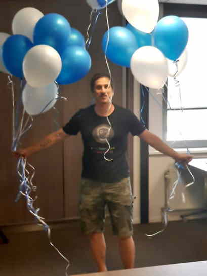

 

# Adrian aka whiteadi (not a swablu)

I Am A Cybernetic Organism, Living Tissue Over (Metal) Endoskeleton

## About

Well here are all kinds of projects or framents of, some done for fun some for work :)

Do not look on all for the best practices or whatnot because some are like timed assignements

or working with students or whatever where the get it done factor had prio, or not ;)

<!--
**whiteadi/whiteadi** is a ✨ _special_ ✨ repository because its `README.md` (this file) appears on your GitHub profile.

Here are some ideas to get you started:

- 🔭 I’m currently working on ...
- 🌱 I’m currently learning ...
- 👯 I’m looking to collaborate on ...
- 🤔 I’m looking for help with ...
- 💬 Ask me about ...
- 📫 How to reach me: ...
- 😄 Pronouns: ...
- ⚡ Fun fact: ...
-->
